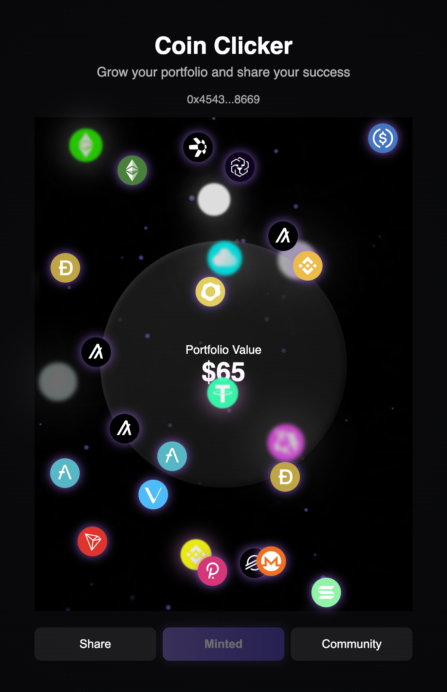

# 🪙 Farcaster Coin Clicker

<div align="left">
  <a href="https://farcaster.xyz/miniapps/DUHyXvDOjMVR/coin-clicker" rel="nofollow">
    
  </a>
  <a href="https://github.com/0x4543/farcaster-coin-clicker/stargazers">
    
  </a>
  <a href="https://github.com/0x4543/farcaster-coin-clicker/blob/main/LICENSE">
    
  </a>
  
  
  
</div>

**Farcaster Coin Clicker** is a playful Farcaster Mini App where users grow their virtual portfolio and mint an NFT on the **Base** network. Built for fun, engagement, and to explore the creative potential of Farcaster Mini Apps.

<p align="center">
  
</p>

---

## ✨ Overview

Coin Clicker lets you tap to grow your portfolio, share progress to Farcaster, and mint your portfolio NFT directly on Base. Designed for smooth mobile experience inside the Farcaster app and works standalone on web.

---

## ⚙️ Features

- Farcaster Mini App integration via `@farcaster/miniapp-sdk`
- Wallet authentication using **Privy**
- On-chain NFT minting on **Base Mainnet**
- Animated tap interaction and coin burst effect
- Seamless UI for both standalone and embedded modes

---

## 🧩 Tech Stack

- **React + Vite** frontend
- **Ethers.js v6** for blockchain interactions
- **Privy** for wallet and Farcaster login
- **Farcaster Mini App SDK** for in-app actions
- **Base** network for NFT minting

---

## 🚀 Getting Started

### 1. Clone the repo

```bash
git clone https://github.com/0x4543/farcaster-coin-clicker.git
cd farcaster-coin-clicker
```

### 2. Install dependencies

```bash
npm install
```

### 3. Set up environment variables

Create a `.env` file based on the provided example:

```bash
cp .env.example .env
```

Edit `.env` with your Privy app ID:

```
VITE_PRIVY_APP_ID=your_privy_app_id
```

### 4. Run locally

```bash
npm run dev
```

### 5. Build for production

```bash
npm run build
```

---

## ☁️ Deployment

The project is optimized for **Vercel** deployment.

1. Push your repo to GitHub.
2. Connect it to Vercel.
3. Add your environment variables in Vercel settings.
4. Deploy 🚀

Live demo: _(add your Vercel link here)_

---

## 🔗 Useful Links

- **Farcaster:** [https://farcaster.xyz](https://farcaster.xyz)
- **Base Network:** [https://base.org](https://base.org)
- **Privy:** [https://www.privy.io](https://www.privy.io)

---

## 🧠 Future Plans

- Community search integration inside Farcaster app
- Portfolio-based NFT metadata
- Extended miniapp features (leaderboard, rewards)

---

## 📄 License

[MIT License](./LICENSE)

---

## 🧑‍💻 Author

**0x4543**  
Farcaster: [@0x4543](https://warpcast.com/0x4543)  
GitHub: [https://github.com/0x4543](https://github.com/0x4543)
